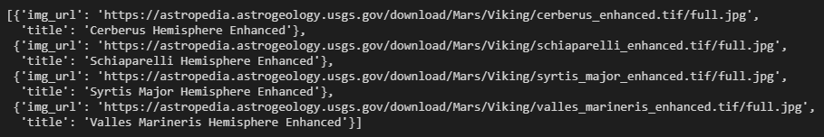
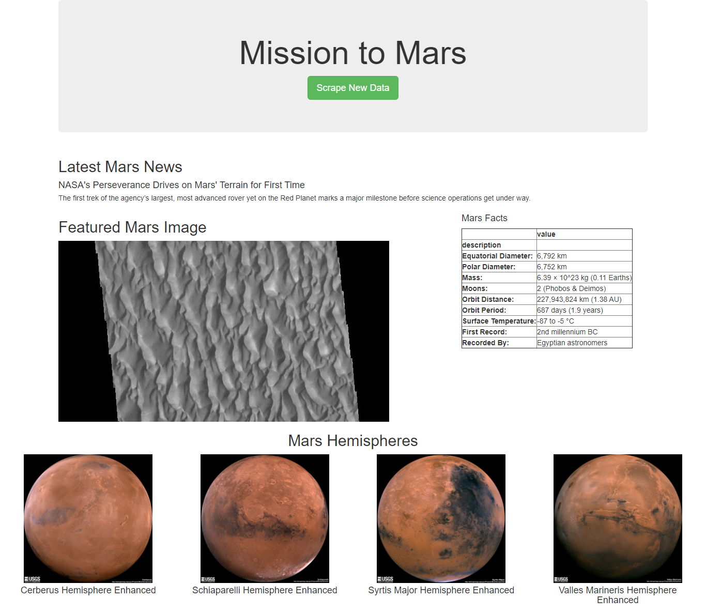
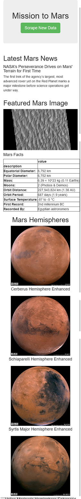
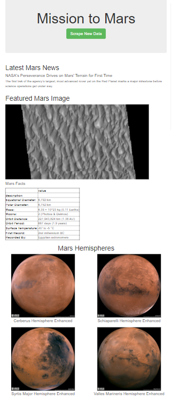

# Mission to Mars

## Overview
A junior data scientist, Robin, does freelance astronomy work in her free time. Her dream is to get a job with NASA some day and often visits website with news about space exploration. Especially, the mission to mars. She wanted to create a script that can gather all the information she looks for in one place. She hopes it may get NASA's attention.

I am helping Robin build a web application using:
1. A **Python** script which will scrape data related to mars from various space exploration websites 
2. The data will then be stored in document based database, **MongoDB** 
3. It will then be displayed in a web application using **Flask**, and made responsive for various device types using **Bootstrap**

The various elements scraped and displayed in the **Mission to Mars** web application are:

* Title and Summary of most recent news article on NASA's Mars News website (https://mars.nasa.gov/news/)
* Featured image from Jet Propulsion Laboratory's Space Images page (https://data-class-jpl-space.s3.amazonaws.com/JPL_Space/index.html)      
* Information about Mars in tabular format from Mars Facts webpage on Space Facts website (https://space-facts.com/mars/)  
* Images and Titles of Mars' hemispheres from USGS Astrogeology Science Center (https://astrogeology.usgs.gov/search/results?q=hemisphere+enhanced&k1=target&v1=Mars)

## Deliverables:

### 1. Image URLs and Titles of Mars Hemispheres

### 2. Web App Screenshots on Various Devices

**Desktop Version**

**Mobile Version**

**Tablet Version**

### 3. Bootstrap Elements Used

1. Used following Bootstrap class to show thumbnail version of Mars Hemispheres images in single row for Desktop version, two images per row for tablet version, and single image for mobile version.

    `
`

2. Changed the color of "Scrape New Data" button using following Bootstrap class.

    `class="btn btn-success btn-lg"`
